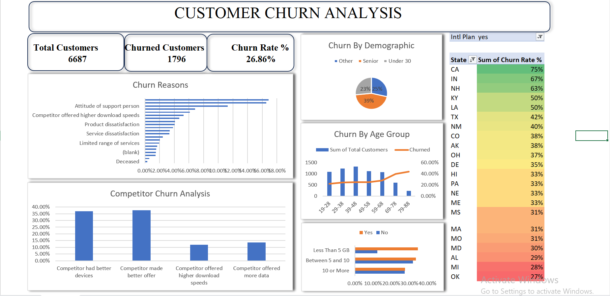

# Customer-Churn-Analysis-Excel-
# Table of Contents

- [Project Overview](#project-overview)
- [Objectives](#objectives)
- [Tools & Technologies](#tools--technologies)
- [Dataset](#dataset)
- [Dashboard Preview](#dashboard-preview)
- [Key Insights](#key-insights)
- [author](#author)
## Project Overview

This project analyzes customer churn data for DataBel to identify patterns and factors that contribute to customers leaving a service. The analysis helps the Business understand customer behavior and develop strategies to improve customer retention.

## Objectives

* Identify the factors that influence customer churn.
* Compare churn rates across different customer segments.
* Discover patterns in contract types, tenure, and services used.
* Provide insights that can help reduce churn.

## Tools & Technologies

* Microsoft Excel – Data Cleaning
* Microsoft Excel – Data Visualization and Dashboard
* Data Analysis Techniques
* Microsoft Excel - Pivot Tables, KPI Calculation, and Data modeling

## Dataset

The dataset contains customer information such as:

* Customer demographics
* Services subscribed
* Contract type
* Monthly charges
* Tenure
* Churn status (Yes/No)

## Dashboard Preview

## Key Insights

Overall CHURN RATE: 26.86% (1,796 out of 6,687 customers).

 1.The TOP CHURN REASON is “Competitor made better offer” (16.87%).
 
 2.Closely followed by “Competitor had better devices” (16.54%).
Combined, competitive factors account for approximately 33.41% of total churn reasons.

 3.Churn is more concentrated in specific states and higher age segments.
 
 4.Older age segments show relatively higher churn patterns. 
 
The data suggests that customer attrition is primarily influenced by competitive market pressure rather than internal service dissatisfaction alone. Strengthening pricing strategy, enhancing bundled offers, and introducing device upgrade incentives could significantly reduce churn risk.

## Author

Samuel Wusu

